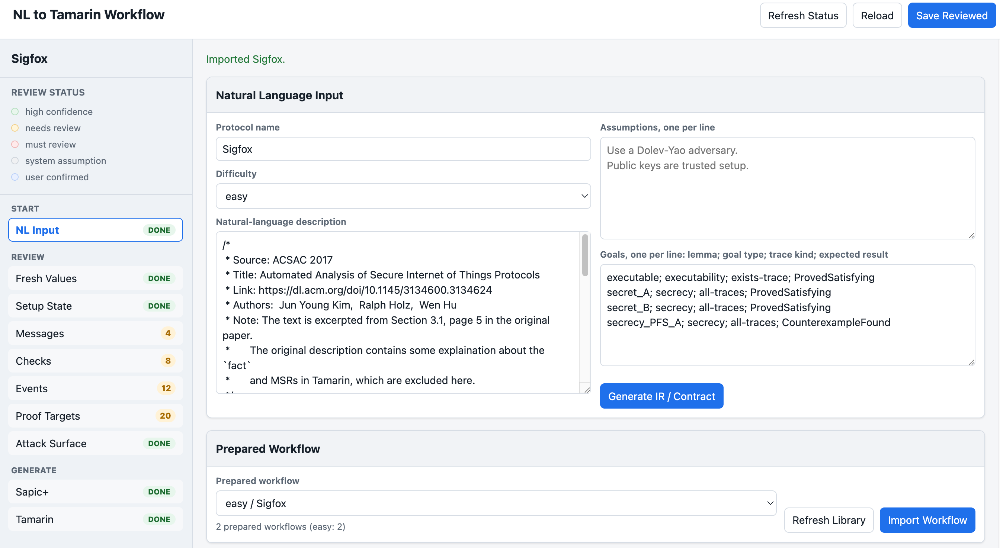
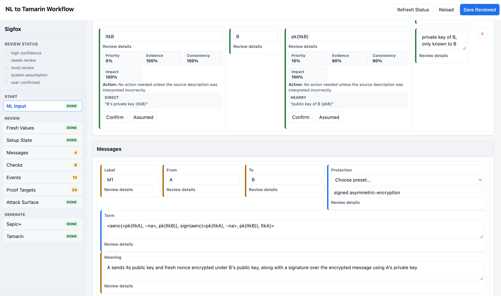
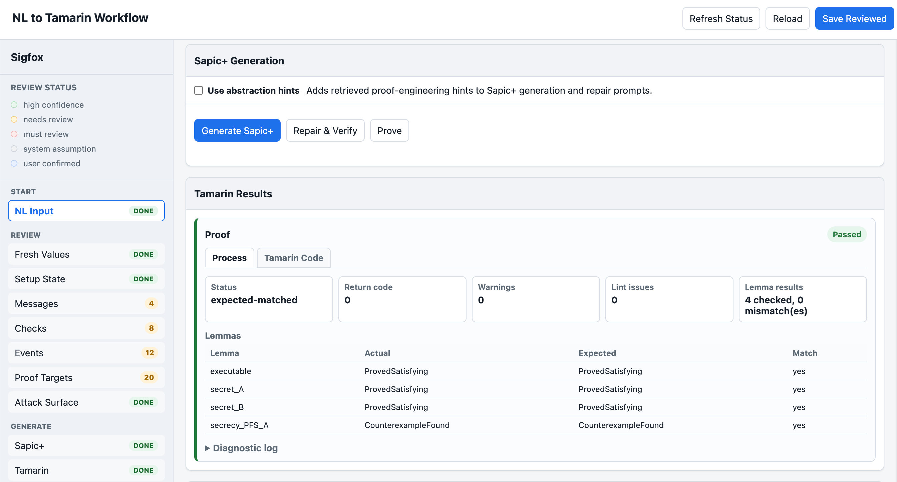

# Confidence-Guided Protocol IR Review UI

This repository contains a local human-in-the-loop UI for LLM-aided security protocol modeling. It supports the workflow described in our work:

> Confidence-Guided Protocol IR for LLM-Aided Security Protocol Modeling

The system introduces a protocol intermediate representation (IR) as a semantic checkpoint between natural-language protocol descriptions and Sapic+/Tamarin generation, enabling reviewers to audit LLM-generated protocol models for semantic accuracy before formal verification.

## UI Preview

The screenshots below show the Sigfox prepared workflow loaded in the review UI.

### Workflow Import



### Field Review



### Tamarin Results



## Repository Layout

- `run_contract_review_ui.py`: local HTTP server and workflow API.
- `contract_review_ui/`: browser UI.
- `protocol_ir_pipeline/`: IR processing, modeling-contract generation, Sapic+ generation, repair, proof lint, and Tamarin helpers.
- `protocol_ir_pipeline/c_to_ir.py`: staged C/C++ source to ProtocolIR extraction with embedded prompts.
- `scripts/c_to_protocol_ir.py`: command-line entry point for the C/C++ extraction flow.
- `config/`: default local lint/retrieval configuration.
- `examples/ui_input_cases.json`: UI-ready benchmark inputs used for experiments.
- `examples/ui_inputs.md`: copy-friendly benchmark inputs for manually filling the UI, grouped by difficulty.
- `examples/protocol-abstraction-cases.json`: bundled abstraction-hint library, used only when enabled in the UI.
- `examples/prepared_workflows/gpt55/`: raw IR and human-reviewed IR snapshots for the benchmark cases.
- `examples/user_tested_workflows/deepseek_ui_20260615/`: Toy and Sigfox workflows manually tested by author through UI.
- `NOTICE.md`: attribution and artifact-scope notes.
- `LICENSE`: GPLv3 license text.

## Requirements

- Python 3.10+
- An LLM API key for DeepSeek, OpenAI, Anthropic, or an OpenAI-compatible Llama endpoint
- `tamarin-prover` on your `PATH` for compile/proof verification. Install Tamarin Prover by following the official instructions for your platform: <https://tamarin-prover.com/manual/master/book/002_installation.html>.

Install Python dependencies:

```bash
pip install -r requirements.txt
```

Configure credentials:

```bash
cp .env.example .env
# edit .env and set the provider API key
```

## Run The UI

Start with an empty workflow directory:

```bash
python3 run_contract_review_ui.py \
  --run-dir runs/local_demo \
  --provider deepseek \
  --host 127.0.0.1 \
  --port 8765
```

Open:

```text
http://127.0.0.1:8765/
```

Typical workflow:

1. Paste a natural-language protocol description and generate the raw IR/modeling contract.
2. Review and edit semantic fields in Messages, Checks, Events, Proof Targets, and Attack Surface.
3. Click `Save Reviewed` to write `modeling_contract.reviewed.json`.
4. Click `Generate Sapic+`.
5. Compile and prove with Tamarin if `tamarin-prover` is installed.

`Save Reviewed` does not require every review badge to be confirmed. Confirming fields is useful for review-progress tracking and for proof-critical generation hints, but saved edits are still used by generation.

## C/C++ Source Extraction

The extraction stages, JSON output contracts, and prompts are in `protocol_ir_pipeline/c_to_ir.py`.

Run the staged extraction with an LLM:

```bash
python3 scripts/c_to_protocol_ir.py \
  --source path/to/protocol.c \
  --output-dir runs/c_to_ir_demo \
  --name MyProtocol \
  --provider deepseek
```

This repository includes a sanitized C-to-IR demo artifact of `tpm2-sessions.c`. The following command start the UI and open the demo:

```bash
python3 run_contract_review_ui.py \
  --run-dir runs/local_demo \
  --provider deepseek \
  --host 127.0.0.1 \
  --port 8765
```

```text
http://127.0.0.1:8765/c-code-demo
```

## Protocol IR Review

Protocol IR records the semantic decisions that need to be correct for the final formal model to be meaningful, including:

- protocol roles and long-term setup values;
- message construction, parsing, encryption, signing, and verification;
- value provenance, including fresh values, received values, derived values, and revealed values;
- events used by proof targets;
- secrecy, authentication, executability, and expected-counterexample targets;
- attack-surface assumptions.

## Abstraction Hints

The UI can locate the bundled abstraction-hint library after startup, but it does not use it unless the user checks `Use abstraction hints` before generating Sapic+. When that checkbox is enabled, the backend retrieves proof-engineering hints from:

```text
examples/protocol-abstraction-cases.json
```

You can replace this library or use another one with:

```bash
python3 run_contract_review_ui.py \
  --run-dir runs/local_demo \
  --abstraction-hints-path /path/to/protocol-abstraction-cases.json
```

## Prepared IR Snapshots

`examples/prepared_workflows/gpt55/` contains raw IR and human-reviewed IR snapshots for the benchmark cases. Each case includes only:

```text
ir/protocol_ir.json
ir/protocol_ir.reviewed.json
```

These files are compact examples of the IR before and after human review.

## User-Tested UI Workflows

`examples/user_tested_workflows/deepseek_ui_20260615/` contains two workflows that were actually run through the UI during manual testing:

```text
Toy
Sigfox
```

They include the lightweight artifacts from those UI runs: input/review artifacts, prompts, LLM call metadata, generated Tamarin models, compile/repair outputs, and proof logs. API credentials are not included.

To inspect them in the UI, start the server with this workflow library:

```bash
python3 run_contract_review_ui.py \
  --run-dir runs/tmp_user_tested_review \
  --workflow-library-dir examples/user_tested_workflows/deepseek_ui_20260615 \
  --provider deepseek \
  --host 127.0.0.1 \
  --port 8765
```

Then open the UI, use `Select prepared workflow...`, and choose `easy / Toy` or `easy / Sigfox`.

## Existing Workflow Library

You can optionally expose a directory of prepared workflows to import from the UI:

```bash
python3 run_contract_review_ui.py \
  --run-dir runs/local_demo \
  --workflow-library-dir /path/to/prepared/workflows \
  --provider deepseek
```

## Benchmark Inputs

`examples/ui_input_cases.json` contains 18 protocol inputs prepared for this review UI. They are represented as natural-language descriptions, assumptions, goals, and expected results that can be copied into the UI.

For manual testing, `examples/ui_inputs.md` contains the same cases in one copy-friendly Markdown file, grouped into Easy, Medium, and Hard sections.

Included cases:

```text
Example, NSPK, Naxos, Toy, Woo_Lam, sigfox, EDHOC, KEMTLS, LAK06, SPLICE,
SSH, CCITT_X509, Denning_Sacco, Kao_Chow, NSSK, Neuman_Stubblebine,
Otway_Rees, Yahalom
```

## Attribution

The benchmark inputs in `examples/ui_input_cases.json` were organized from the AutoSM 18-case benchmark inputs. The full AutoSM benchmark reference Sapic+/Tamarin files are not included in this package.

> Ziyu Mao, Jingyi Wang, Jun Sun, Shengchao Qin, and Jiawen Xiong. "LLM-Aided Automatic Modeling for Security Protocol Verification." ICSE 2025. DOI: [10.1109/ICSE55347.2025.00197](https://dl.acm.org/doi/10.1109/ICSE55347.2025.00197).

AutoSM artifact repository: <https://github.com/zerrymore/AutoSM>

This package is distributed with the GPLv3 license text in `LICENSE`. See `NOTICE.md` for the artifact-scope attribution notes.
